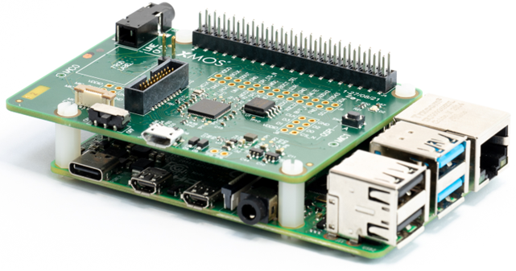

############################################
lib_device_control: Device Control for XCORE
############################################

|newpage|

************
Introduction
************

The Device Control Library is a protocol layer that handles the routing of control messages between a host and one or
many controllable resources within the controlled device as shown in :numref:`control_logical_view`.
The library is transport agnostic and can be used with physical transports such as I2C, SPI, USB or
`XSCOPE <https://www.xmos.com/documentation/XM-014363-PC/html/tools-guide/tools-ref/xscope/index.html#xscope>`_.

.. figure:: ../images/control_logical_view.pdf
   :width: 70%
   :name: control_logical_view

   Logical view of lib_device_control

All communications are fully acknowledged and so the host will be informed whether or not the
device has correctly received or provided the required control information.

See ``README`` for currently supported combinations of host and transport mechanisms.

*****
Usage
*****

``lib_device_control`` is intended to be used with the
`XCommon CMake <https://www.xmos.com/file/xcommon-cmake-documentation/?version=latest>`_,
the `XMOS` application build and dependency management system.

To use this library in an application include ``lib_device_control`` in the application's ``APP_DEPENDENT_MODULES`` list in
`CMakeLists.txt`, for example:

.. code-block:: cmake

    set(APP_DEPENDENT_MODULES "lib_device_control")

.. note:: Dependent modules should be pinned to release versions where possible, otherwise the
   latest commit on the `develop` branch will be used.  For further details on managing modules,
   pinning to a release version and other options, please see the page
   `xcommon-cmake Dependency Management <https://www.xmos.com/documentation/XM-015090-PC/html/doc/dependency_management.html>`_.

All ``lib_device_control`` device functions can be accessed via the ``control.h`` header file, for example:

.. code-block:: C

    #include "control.h"

To select the transport layer for the device application, the preferred option is to create a control config header file ``control_conf.h`` in the application source directory and define the appropriate transport macro, for example:

.. code-block:: c

    #define CONTROL_USE_USB 1

.. note:: Please ensure the path to ``control_conf.h`` is included in the application's include path list, ``APP_INCLUDES``.

Alternatively, the transport macro can be defined in the application's ``CMakeLists.txt`` file using the ``APP_COMPILER_FLAGS``, for example:

.. code-block:: cmake

    set(APP_COMPILER_FLAGS ... -DCONTROL_USE_USB=1 ...)

Host Usage
==========

The build system used for the host is native CMake, so the process for using the library on the host is slightly different to the device side.

Instead of setting the ``APP_DEPENDENT_MODULES`` variable, the host application must include the appropriate ``CMake`` file for the intended transport.
The transport-specific ``CMake`` file will set up the necessary source and include paths and link against the appropriate transport library for the host application.
The files are found in ``lib_device_control/host``, for example ``host_build_usb.cmake`` for USB transport.

.. code-block:: cmake

   include("${CMAKE_CURRENT_LIST_DIR}/../../../host/host_build_usb.cmake")

The host application should then link against the provided transport library, for example ``control_usb_host`` for USB transport,
after calling ``add_executable()`` for the host application target in `CMakeLists.txt`, for example:

.. code-block:: cmake

   add_executable(usb_host_app "src/host.c")

   target_link_libraries(usb_host_app PRIVATE control_usb_host)

The ``lib_device_control`` host functions can be accessed via the ``control_host.h`` header file, for example:

.. code-block:: C

   #include "control_host.h"

Host dependencies
-----------------

For Windows hosts, the supported compiler is `MSVC`.
The `Ninja build system <https://ninja-build.org/>`_ is recommended to be used with CMake, but it is not required.
The ``libusb`` library is available via the ``host_build_usb.cmake`` file.

For Linux hosts, including Raspberry Pi, the supported compiler is `GCC`.
The ``libusb-1.0-0-dev`` package must be installed for USB transport, and the the ``host_build_usb.cmake`` file will link against the library.

For OSX hosts, the supported compiler is `Clang`. The ``libusb`` library is available via the ``host_build_usb.cmake`` file.

|newpage|

*********
Operation
*********

The `Host` communicates with resources on an XCORE device by sending `commands` to it over a
physical `transport`, as shown in :numref:`control_packet`. Resources are identified by an 8-bit identifier and exist in
tasks that run on threads of the device. There can be multiple resources in a task.

The command code is 8 bits and is a `write` command when bit 7 is not set or a `read` command when bit 7 is set.
It is an application design decision whether the commands are common across all resources or
unique to each resource, but the library provides a simple mechanism for routing commands to
the correct resource based on the resource ID.

The length field is 8 bits and indicates the number of bytes of data related to the command, which can be zero.

.. figure:: ../images/control_packet.pdf
   :width: 80%
   :name: control_packet

   Packet for control communications

Read and write Commands can include `data` bytes that are optional, but the number of data bytes transferred
must equal the length field.

When starting a new request, the `resource ID`, `command code` and `length` fields are all sent by the host for
read and write commands, but the `data` bytes are only sent by the host for write commands. For read commands,
the device sends the `data` bytes back to the host.

There is a transport task in the device (e.g. I2C slave or USB endpoint 0) that dispatches all commands.
All other tasks that have resources connect to this transport task over the ``control`` interface.

Tasks `register` their resources during initialisation when requested over the interface.

When commands are received by the transport task they forwarded over the matching ``control`` interface.
The mapping of resources to tasks is done by the application and the library simply forwards the command
to the appropriate task based on the resource ID, as shown in the figure
:numref:`resource_mapping`:

.. figure:: ../images/resource_mapping.pdf
   :width: 80%
   :name: resource_mapping

   Mapping between resource IDs and XC interfaces

This means multiple tasks residing in different threads or even tiles on the device can be easily
controlled using a single instance of the Device Control library and a single API from the host.

Commands have a result code to indicate success or failure. The result is propagated to the host so
the host can indicate whether an error occurred to the user.

The control library supports USB (device is USB device), I2C (device is I2C slave), SPI (device is SPI slave)
and XSCOPE (device is target connected via XTAG debug adapter) as physical layers. The maximum data packet size for
each of the transport types is as shown in :numref:`transport_data_length`.

.. list-table:: Maximum Data Length for Device Control Library Transports
 :header-rows: 1
 :name: transport_data_length

 * - Transport
   - Data length
   - Limitation
 * - I2C
   - 253 Bytes
   - Arbitrary
 * - USB
   - 64 Bytes
   - USB control transfer specification
 * - XSCOPE
   - 252 Bytes
   - Arbitrary
 * - SPI
   - 253 Bytes
   - Arbitrary

It would be straightforward to add support for additional physical layers such as UART or
TCP/UDP over Ethernet or add additional control hosts where the hardware and operating system supports it.

|newpage|

*********
Transport
*********

The transport task receives its natural unit of data, such as I2C transaction, or USB request, and
calls a processing function on it from the library. At the same time it passes in the whole array of XC interfaces
which connect to all of the controlled tasks.

The library's logic happens inside the function that is called and once a command is complete, an
XC interface call is made to pass the command over to the appropriate controlled resource.

The receiving task then receives a write or read command over the XC interface.

To ensure compatibility, a special command is provided to query the version of control XC interface. This
allows the host to query the device and check that it is running the same version, which will ensure
command compatibility.

Please see `Device side Transport`_, `Device side`_ and `Host side`_ sections for further details.

I2C, SPI and XSCOPE Transports
==============================

I2C, SPI and XSCOPE Transports are very similar in concept, so the I2C is given here as an example.

Allocating hardware resources
-----------------------------

Allocating the necessary pins for the transport is the responsibility of the application.
For example, for an I2C slave application, two ports must be allocated for SCL and SDA lines and passed to the I2C slave function in the transport task, for example:

.. literalinclude:: ../../examples/i2c/device/src/main.xc
   :language: c
   :start-at: PORT_I2C_SCL;
   :end-at: PORT_I2C_SDA;

Declaring interfaces
--------------------

The application must declare an interface for the transport and for the control library, for example:

.. literalinclude:: ../../examples/i2c/device/src/main.xc
   :language: c
   :start-at: int main(void)
   :end-at: interface control i_control

Registering Controllable Resources
----------------------------------

Before any control can take place the controlled tasks must register controllable resources.
This is done by calling ``control_register_resources()`` at startup, before calling into the tasks.

.. literalinclude:: ../../examples/i2c/device/src/main.xc
   :language: c
   :start-at: control_init();
   :end-at: control_register_resources

The application side of the registration process is handled by populating a table of resource IDs at startup which is done by ``register_resources()``.

.. literalinclude:: ../../examples/i2c/device/src/app.xc
   :language: c
   :start-at: case i_control.register_resources
   :end-at: break;

Transport Tasks
---------------

The transport task must be called in main and provided the control interface, the control client must be called, ``i2c_control_client`` in this example:

.. literalinclude:: ../../examples/i2c/device/src/main.xc
   :language: c
   :start-after: /* Transport and control tasks */
   :end-at: }

Application Task
----------------

The application task must be called in main and provided the control interface, for example:

.. literalinclude:: ../../examples/i2c/device/src/main.xc
   :language: c
   :start-at: on tile[PORT_I2C_SCL_TILE_NUM]: par {
   :end-at: }

Reading over Device Control
---------------------------

When the host requests a read from a controlled resource, the ``read_command()`` is called on the interface.
The example is very simple, it checks the resource ID is correct then returns the last command that was written to the resource.

.. literalinclude:: ../../examples/i2c/device/src/app.xc
   :language: c
   :start-after: /* DOC-TAG: READ */
   :end-before: /* DOC-TAG: READ_END */

Writing over Device Control
---------------------------

When the host requests a write to a controlled resource, the ``write_command()`` is called on the interface.
The example is very simple, it checks the resource ID is correct then records the data on the resource.

.. literalinclude:: ../../examples/i2c/device/src/app.xc
   :language: c
   :start-after: /* DOC-TAG: WRITE */
   :end-before: /* DOC-TAG: WRITE_END */

USB Transport
=============

The USB transport is slightly different to the I2C, SPI and XSCOPE transports as it is based on handling USB requests
on endpoint 0. However, the same principles apply in terms of registering resources and handling read and write commands.

USB Application main() function
-------------------------------

The ``main()`` function sets up the pins and tasks within the application. The difference to other transports is that there is typically an Endpoint0 task.

.. literalinclude:: ../../examples/usb/device/src/main.xc
   :language: c
   :start-at: XUD_EpType epTypeTableOut

USB Descriptors
---------------

USB requires descriptors to describe the devices capabilities. The example provides only a single interface with only the control endpoint (0)
and so the device descriptor and configuration descriptor are very simple. The device descriptor indicates that the device is a Vendor Class device,
which means it will use Vendor requests for communication between the host and device, which are handled by the Device Control library.
The USB device descriptor:

.. literalinclude:: ../../examples/usb/device/src/endpoint0.xc
   :language: c
   :start-at: /* Device Descriptor */
   :end-at: devDesc

And configuration descriptor:

.. literalinclude:: ../../examples/usb/device/src/endpoint0.xc
   :language: c
   :start-at: /* Configuration Descriptor */
   :end-at: cfgDesc

The descriptors are requested by the host during enumeration and are handled in the Endpoint0 task:

.. literalinclude:: ../../examples/usb/device/src/endpoint0.xc
   :language: c
   :start-at: if(result == XUD_RES_ERR)
   :end-at: }

Reading over Device Control
---------------------------

When the host requests a read from a controlled resource, endpoint 0 receives a device-to-host Vendor request.

.. literalinclude:: ../../examples/usb/device/src/endpoint0.xc
   :language: c
   :start-at: case USB_BMREQ_D2H_VENDOR_DEV
   :end-at: break;

The Device Control transport function ``USB_D2H_VendorRequest()`` takes the USB setup packet and channels
along with the control interface and wraps the USB data transaction that is translated to a control command.
A call to the ``read_command()`` method is subsequently made on the server side control interface which is
then handled by the application. Once the application has filled the buffer with data, the data buffer reference
is returned to ``lib_xud`` by EP0 and the USB control transaction is completed.
The Vendor request transaction is stalled to indicate failure to the host.

.. literalinclude:: ../../examples/usb/device/src/app.xc
   :language: c
   :start-after: /* DOC-TAG: READ */
   :end-before: /* DOC-TAG: READ_END */

Writing over Device Control
---------------------------

When the host requests a write to a controlled resource, endpoint 0 receives a host-to-device Vendor request.

.. literalinclude:: ../../examples/usb/device/src/endpoint0.xc
   :language: c
   :start-at: case USB_BMREQ_H2D_VENDOR_DEV:
   :end-at: break;

The Device Control transport function ``USB_H2D_VendorRequest()`` takes the USB setup packet and channels
along with the control interface and wraps the USB data transaction that is translated to a control command.
The call to the ``write_command()`` method is subsequently made on the control interface which is then handled
by server side in the application.
The USB transaction is then either be acknowledged or stalled by the EP0 handler to indicate success or failure to the host.

.. literalinclude:: ../../examples/usb/device/src/app.xc
   :language: c
   :start-after: /* DOC-TAG: WRITE */
   :end-before: /* DOC-TAG: WRITE_END */

Windows USB BOS/MSOS Support
----------------------------

Windows requires a special USB descriptor, the BOS/MSOS descriptor, to be able to use WinUSB
as the driver for the device. This descriptor is provided by ``lib_xud`` and available by calling
``XUD_GetBosDescriptor()`` and ``XUD_GetMsosDescriptor()``. The BOS descriptor handling is a
standard device request:

.. literalinclude:: ../../examples/usb/device/src/endpoint0.xc
   :language: c
   :start-at: case USB_BMREQ_D2H_STANDARD_DEV:
   :end-at: break;

The MSOS descriptor is requested by the host as a Vendor request:

.. literalinclude:: ../../examples/usb/device/src/endpoint0.xc
   :language: c
   :start-at: case USB_BMREQ_D2H_VENDOR_DEV:
   :end-at: } else {
 
|newpage|

*******************************************
Device Firmware Upgrade over Device Control
*******************************************

The Device Control library can be used to implement a simple device firmware upgrade (DFU) mechanism over USB, I2C or XSCOPE
by using the control read and write commands to send firmware data from the host to the device and then writing that data to
flash memory on the device. This is demonstrated in the DFU example application in `lib_dfu <https://www.xmos.com/libraries/lib_dfu>`_
(https://www.xmos.com/libraries/lib_dfu).

To use enable the required configuration setting in ``control_conf.h``:

.. code-block:: C

   #define CONTROL_APP_DFU 1

|newpage|

*******************
Example application
*******************

Building the example
====================

There are many example applications provided in the ``examples`` directory of the software package,
which demonstrate how to use the library with different physical layers and on different host platforms.
The following instructions are for the USB example, but the process is very similar for the I2C, SPI and XSCOPE examples.

This section assumes that the `XMOS XTC Tools <https://www.xmos.com/software-tools/>`_ have been
downloaded and installed. The required version is specified in the accompanying ``README``.

Installation instructions can be found `here <https://www.xmos.com/xtc-install-guide>`_.

Special attention should be paid to the section on
`Installation of Required Third-Party Tools <https://www.xmos.com/documentation/XM-014363-PC/html/installation/install-configure/install-tools/install_prerequisites.html>`_.

The application is built using the `xcommon-cmake <https://www.xmos.com/file/xcommon-cmake-documentation/?version=latest>`_
build system, which is provided with the XTC tools and is based on `CMake <https://cmake.org/>`_.

The ``lib_device_control`` software ZIP package should be downloaded and extracted to a chosen working
directory.

To configure the build, the following commands should be run from an XTC command prompt:

.. code-block:: console

    cd lib_device_control/examples/usb/device
    cmake -G "Unix Makefiles" -B build

If any dependencies are missing they will be retrieved automatically during this step.

The application binaries should then be built using ``xmake``:

.. code-block:: console

    xmake -j -C build

Binary artifacts (.xe files) will be generated under the appropriate subdirectories of the
``examples/usb/device/bin`` directory — one for each supported build configuration.

For subsequent builds, the ``cmake`` step may be omitted.
If ``CMakeLists.txt`` or other build files are modified, ``cmake`` will be re-run automatically
by ``xmake`` as needed.

Running the example
===================

From an XTC command prompt, the following command should be run from the ``examples/usb/device``
directory:

.. code-block:: console

    xrun --xscope ./bin/usb.xe

Alternatively, the application can be programmed into flash memory for standalone execution:

.. code-block:: console

    xflash ./bin/usb.xe

Building the example host app
=============================

This is very similar to building the device example, except the host example is in the ``examples/usb/host`` directory,
and the host compiler must be in the path. The host app can be built from a command terminal with the commands shown in :numref:`build_host_linux`.

.. code-block:: console
   :caption: Building the host app on Linux or Mac hosts
   :name: build_host_linux

   cd lib_device_control/examples/usb/host
   cmake -G "Unix Makefiles" -B build
   xmake -j -C build
   ./bin/usb_host_app

For Windows hosts the process is the same except the Ninja generator is recommended to be used with CMake and the executable will have a ``.exe`` extension.
The commands are shown in :numref:`build_host_windows`.

.. code-block:: console
   :caption: Building the host app on Windows hosts
   :name: build_host_windows

   cd lib_device_control\examples\usb\host
   cmake -G "Ninja" -B build
   cmake --build build
   bin\usb_host_app.exe

Example Hardware Setup
======================

To run the example, connect a USB cable to power the `XK-VOICE-L71` board as shown in :numref:`board_l71_hw_setup`,
and plug the XTAG to the board and connect the XTAG USB cable to your development machine.

.. figure:: ../images/board_l71_hw_setup.png
   :width: 60%
   :name: board_l71_hw_setup

   XK-VOICE-L71 USB Hardware setup

Raspberry Pi Hardware Setup
---------------------------

For the examples with the Raspberry Pi as a host, the I2C, SPI and USB examples, the `XK-VOICE-L71` board can be stacked on top
of a Raspberry Pi as shown in :numref:`board_l71_rpi_stacked`, and the I2C and SPI lines are connected between the two boards.
For the USB example a USB cable should be connected between the Raspberry Pi and the `XK-VOICE-L71`.
The XTAG should be connected to the `XK-VOICE-L71` as normal and the host app can be run from the Raspberry Pi terminal.

   XK-VOICE-L71 Raspberry Pi Hardware setup

Output from the example applications
------------------------------------

When run, the host app will attempt to connect and communicate with the device over USB.
The outputs listings are shown in :numref:`device_app_output` and :numref:`host_app_output` for the device and host applications respectively.

.. code-block:: console
   :caption: Example device app output
   :name: device_app_output

   > xrun --xscope .\bin\usb.xe
   started
   1: W 18 0 60, 00 02 03 04 05 06 07 08 09 ... ``PAYLOAD_SIZE`` bytes in total
   2: R 18 128 60
   3: W 18 0 60, 01 02 03 04 05 06 07 08 09 ... ``PAYLOAD_SIZE`` bytes in total
   4: R 18 128 60
   5: W 18 0 60, 02 02 03 04 05 06 07 08 09 ... ``PAYLOAD_SIZE`` bytes in total
   6: R 18 128 60
   7: W 18 0 60, 03 02 03 04 05 06 07 08 09 ... ``PAYLOAD_SIZE`` bytes in total
   8: R 18 128 60

.. code-block:: console
   :caption: Example host app output
   :name: host_app_output

   $ sudo ./bin/usb_host_app
   device found
   started
   Written and read back command with payload: 0x00
   Written and read back command with payload: 0x01
   Written and read back command with payload: 0x02
   Written and read back command with payload: 0x03
   done

The number of bytes sent by the host can be changed with the ``PAYLOAD_SIZE`` macro in the host app's ``host.c`` file.

.. code-block:: c

   #define PAYLOAD_SIZE 60

Example XSCOPE Application
==========================

The process of running the XSCOPE example differs from the other examples due to the data passing over the XSCOPE
transport and accessed via a local Ethernet XSCOPE server.

.. note::
   In order to build the XSCOPE host app the on the host machine, both the hosts' native toolchain and the XTC tools
   must be installed and in the path, then the host app should be built as described in the previous section.

Once the device is built, from an XTC command prompt, the following command should be run from the ``examples/xscope/device``
directory, please note the use of the ``--xscope-port`` option to specify the port for the local XSCOPE server:

.. code-block:: console

   xrun --xscope-port localhost:10101 .\bin\xscope.xe

When run, the host app will attempt to connect and communicate with the device over XSCOPE.
As shown in :numref:`xscope_device_output` and :numref:`xscope_host_output`, the
device prints out very little, but the host app prints out the commands sent and responses received over XSCOPE.

.. code-block:: console
   :caption: Example XSCOPE device app output
   :name: xscope_device_output

   > xrun --xscope-port localhost:10101 .\bin\xscope.xe
   New (non-blocking) xscope_server_socket connection made

.. code-block:: console
   :caption: Example XSCOPE host app output
   :name: xscope_host_output

   >bin\xscope_host_app.exe
   [HOST] connected to server at port 10101
   [HOST] device found
   [HOST] 0 send version command: 00 80 01 72 
   started
   XSCOPE server connected
   [HOST] version response: 00 80 01 00 10 
   [HOST] started
   [HOST] 1 write: 12 00 01 72 00 
   1: W 18 0 1, 00
   [HOST] response: 12 00 01 00 
   [HOST] 2 read, len 4: 12 80 01 72 
   2: R 18 128 1
   [HOST] read response: length 5: 12 80 01 00 00 
   [HOST] Written and read back command with payload: 0x00
   ...
   [HOST] 7 write: 12 00 01 72 03
   7: W 18 0 1, 03
   [HOST] response: 12 00 01 00 
   [HOST] 8 read, len 4: 12 80 01 72 
   8: R 18 128 1
   [HOST] read response: length 5: 12 80 01 00 03 
   [HOST] Written and read back command with payload: 0x03
   [HOST] done

|newpage|

**********
References
**********

I2C
===

* `lib_i2c <https://www.xmos.com/libraries/lib_i2c>`_ (https://www.xmos.com/libraries/lib_i2c)
* https://developer.mbed.org/users/okano/notebook/i2c-access-examples
* http://www.robot-electronics.co.uk/i2c-tutorial
* https://www.raspberrypi.org/forums/viewtopic.php?f=44&t=15840&start=25

SPI
===

* `lib_spi <https://www.xmos.com/libraries/lib_spi>`_ (https://www.xmos.com/libraries/lib_spi)

USB
===

* `lib_xud <https://www.xmos.com/libraries/lib_xud>`_ (https://www.xmos.com/libraries/lib_xud)
* http://www.beyondlogic.org/usbnutshell/usb6.shtml

XSCOPE
======

* `XSCOPE <https://www.xmos.com/documentation/XM-014363-PC/html/tools-guide/tools-ref/xscope/index.html#xscope>`_ (https://www.xmos.com/documentation/XM-014363-PC/html/tools-guide/tools-ref/xscope/index.html#xscope)

|newpage|

*************
API Reference
*************

Shared
======

.. doxygengroup:: control_shared_group

.. doxygengroup:: control_transport_shared_group

Device side Configuration
=========================

.. doxygengroup:: control_conf

.. doxygendefine:: MAX_RESOURCES_PER_INTERFACE

Device side
===========

.. doxygengroup:: control

.. doxygenfunction:: control_init

.. doxygenfunction:: control_register_resources

.. doxygenfunction:: control_process_i2c_write_start

.. doxygenfunction:: control_process_i2c_read_start

.. doxygenfunction:: control_process_i2c_write_data

.. doxygenfunction:: control_process_i2c_read_data

.. doxygenfunction:: control_process_i2c_stop

.. doxygenfunction:: control_process_usb_set_request

.. doxygenfunction:: control_process_usb_get_request

.. doxygenfunction:: control_process_xscope_upload

Device side Transport
=====================

.. doxygenfunction:: i2c_control_client

.. doxygenfunction:: spi_control_client

.. doxygenfunction:: xscope_control_client

.. doxygenfunction:: USB_H2D_VendorRequest

.. doxygenfunction:: USB_D2H_VendorRequest

DFU Support
===========

.. doxygenfunction:: dfu_control_server

Host side
=========

.. doxygenfunction:: control_init_xscope

.. doxygenfunction:: control_cleanup_xscope

.. doxygenfunction:: control_init_i2c

.. doxygenfunction:: control_cleanup_i2c

.. doxygenfunction:: control_init_usb

.. doxygenfunction:: control_query_version

.. doxygenfunction:: control_write_command

.. doxygenfunction:: control_read_command
